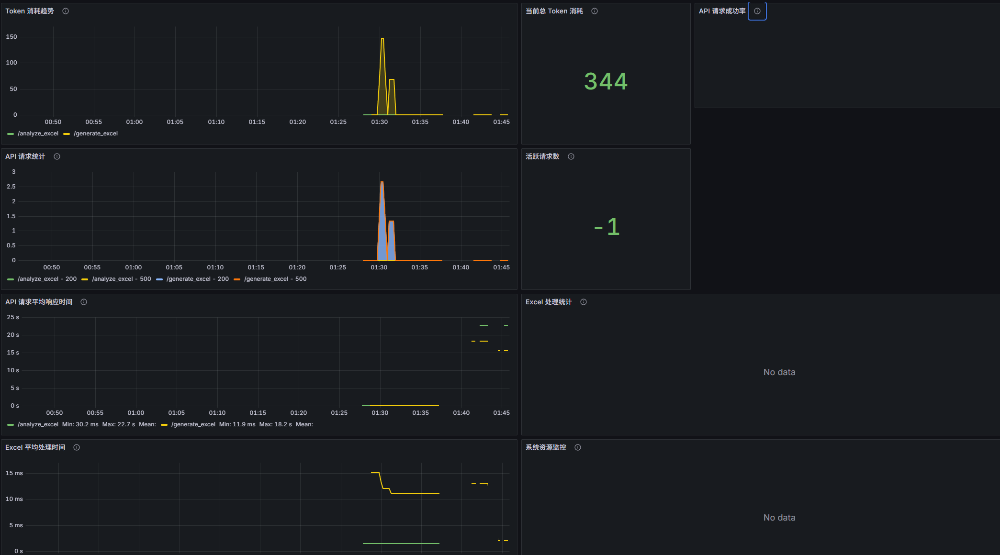

<div align="center">
  
  ExcelGenius 是一款基于AI的智能Excel生成与编辑工具，能够通过自然语言描述快速创建和修改Excel表格，大大提高办公效率。
</div>


通过AI自然语言描述驱动Excel生成，实现智能化办公体验。

<details open>
<summary>
<strong>目录</strong>
</summary>

- [🌈 亮点](#-亮点)
- [✨ 特性](#-特性)
- [🏗️ 项目架构](#%EF%B8%8F-项目架构)
- [🔧 技术栈](#-技术栈)
- [🚀 快速开始](#-快速开始)
- [📊 API 端点](#-api-端点)
- [📈 监控系统](#-监控系统)
- [💻 使用说明](#-使用说明)
- [⚠️ 注意事项](#%EF%B8%8F-注意事项)
- [👨‍💻 开发说明](#-开发说明)
- [🚢 构建与部署](#-构建与部署)
- [🤝 贡献](#-贡献)
- [❤️ 赞助](#%EF%B8%8F-赞助)
- [📄 许可](#-许可)

</details>

## 🌈 亮点

- 🧠 **AI驱动**：通过自然语言描述快速生成和编辑Excel表格，无需手动操作
- 🚀 **高效便捷**：极大提升办公效率，降低Excel操作的学习成本
- 📊 **可视化编辑**：提供直观的表格编辑界面，支持基本的编辑和格式设置
- 🔌 **灵活扩展**：模块化设计，易于扩展新功能和集成其他AI服务
- 🔧 **监控系统**：集成Prometheus和Grafana监控，实时跟踪应用性能
- 🖥️ **前后端分离**：基于FastAPI和Vue3的现代化架构，提供流畅的用户体验
- 📱 **多平台兼容**：支持在不同操作系统和设备上使用

## ✨ 特性

### 📊 Excel生成与编辑

- **自然语言生成Excel**：通过简单的文字描述，快速生成符合需求的Excel表格
- **智能编辑现有Excel**：上传Excel文件后，通过自然语言指令进行编辑操作
- **在线表格编辑器**：提供直观的表格编辑界面，支持基本的编辑和格式设置功能
- **模拟数据模式**：在没有OpenAI API密钥的情况下，使用内置的模拟数据展示功能

### 🔧 系统功能

- **文件管理**：支持Excel文件的上传分析、下载和临时存储
- **配置管理**：灵活的配置选项，支持模型选择和端口设置
- **异常处理**：完善的错误处理和提示机制
- **监控集成**：与Prometheus和Grafana无缝集成，提供实时性能监控

## 🏗️ 项目架构

ExcelGenius采用前后端分离的现代化架构设计，确保系统的可扩展性和可维护性。

```
├── backend/                  # 后端服务（Python）
│   ├── config.py             # 配置（AI模型选择、端口）
│   ├── excel_utils.py        # Excel生成/编辑工具类
│   ├── logger_config.py      # 日志配置
│   ├── main.py               # 核心API（自然语言解析、Excel生成）
│   └── requirements.txt      # Python依赖
├── frontend/                 # 前端页面（Vue3）
│   ├── index.html            # 入口页面
│   ├── package.json          # 前端依赖配置
│   ├── src/                  # 前端源码
│   │   ├── App.vue           # 根组件
│   │   ├── api/              # API请求工具
│   │   ├── assets/           # 静态资源
│   │   ├── components/       # Vue组件
│   │   └── main.js           # 前端入口逻辑
│   └── vite.config.js        # Vite构建配置
├── logstash/                 # 日志处理配置
│   └── bin/
├── prometheus.yml            # Prometheus监控配置
└── excelgenius_monitoring_dashboard.json  # Grafana看板配置
```

## 🔧 技术栈

- **后端**：Python, FastAPI, OpenAI API, openpyxl
- **前端**：Vue 3, Element Plus, Tailwind CSS, Axios, XLSX.js
- **构建工具**：Vite
- **监控系统**：Prometheus, Grafana
- **日志管理**：Logstash

## 🚀 快速开始

### 前置要求

- Python 3.12.8 和 Node.js 20.19 环境
- OpenAI API 密钥（可选，不提供时将使用模拟数据）
- 安装Prometheus和Grafana（用于监控功能）

### 后端安装与运行

1. 进入backend目录
```bash
cd backend
```

2. 安装依赖
```bash
pip install -r requirements.txt
```

3. 配置环境变量（可选）
   - 创建 `.env` 文件
   - 将 `OPENAI_API_KEY` 设置为您的实际API密钥

4. 启动后端服务
```bash
python -m uvicorn backend.main:app --reload --port 8000
```

后端服务默认运行在 `http://127.0.0.1:8000`

### 前端安装与运行

1. 进入frontend目录
```bash
cd frontend
```

2. 安装依赖
```bash
npm install
```

3. 启动前端开发服务器
```bash
npm run dev
```

前端服务默认运行在 `http://127.0.0.1:3001`

## 📊 API 端点

### 生成Excel
- **POST** `/generate_excel`
- **参数**：
  - `description`：Excel内容描述（必填）
  - `file_name`：文件名（可选）
- **返回**：生成的Excel文件信息和下载链接

### 编辑Excel
- **POST** `/edit_excel`
- **参数**：
  - `file`：上传的Excel文件（必填）
  - `instructions`：编辑指令（必填）
- **返回**：编辑后的Excel文件信息和下载链接

### 下载文件
- **GET** `/download/{file_name}`
- **返回**：Excel文件下载

## 📈 监控系统

ExcelGenius集成了完善的监控系统，帮助您实时掌握应用的运行状态。

### Prometheus 配置

项目根目录下的 `prometheus.yml` 文件包含了监控配置，主要监控以下目标：
- Prometheus自身
- ExcelGenius后端服务（端口8000）
- Windows系统资源（通过windows-exporter，端口9182）

### Grafana 看板

项目根目录提供了预配置的Grafana看板文件 `excelgenius_monitoring_dashboard.json`，包含以下监控内容：
- 系统资源使用情况
- API请求统计
- Excel生成/编辑性能指标
- 错误日志监控

## 🐱 项目演示
<!-- 直接展示项目演示图，宽度设为 600px 更清晰 -->


## 📊 Grafana 监控看板
<!-- 直接展示Grafana看板图 -->


## 💻 使用说明

### 生成Excel
1. 在首页的"生成Excel"标签页中，输入您想要的Excel内容描述
2. 可选：输入文件名
3. 点击"生成Excel"按钮
4. 生成完成后，可以下载文件或在表格编辑器中查看

### 编辑Excel
1. 在首页的"编辑Excel"标签页中，选择要编辑的Excel文件
2. 输入编辑指令，例如"在表格末尾添加一行汇总数据"
3. 点击"编辑Excel"按钮
4. 编辑完成后，可以下载文件或在表格编辑器中查看

### 表格编辑器
1. 在首页的"表格编辑器"标签页中，可以查看和编辑Excel内容
2. 支持添加行、添加列、删除选中内容、清空表格等操作
3. 支持基本的格式设置，如字体大小、粗体、斜体、下划线和文字颜色
4. 可以导出编辑后的内容为Excel文件

## ⚠️ 注意事项

1. **OpenAI API 密钥**：如果没有配置有效的OpenAI API密钥，系统将自动切换到模拟数据模式
2. **文件存储**：生成和编辑的Excel文件默认存储在项目的 `temp` 目录中
3. **模拟数据模式**：在模拟数据模式下，系统会根据描述生成预定义的示例数据，仅供演示使用
4. **安全性**：不要在公共环境中暴露包含敏感信息的API密钥

## 👨‍💻 开发说明

### 后端开发
- 配置文件位于 `config.py`，可以修改端口、模型等配置
- Excel处理逻辑位于 `excel_utils.py`，可以扩展更多Excel操作功能
- API端点位于 `main.py`，可以添加更多API功能

### 前端开发
- 使用Vite作为构建工具，可以通过 `vite.config.js` 配置构建选项
- 组件位于 `src/components` 目录
- API请求工具位于 `src/api/request.js`

## 🚢 构建与部署

### 前端构建
```bash
cd frontend
npm run build
```
构建后的文件将位于项目根目录的 `dist` 目录中

### 部署建议
- 后端可以使用Uvicorn或Gunicorn作为ASGI服务器
- 前端构建后的静态文件可以使用Nginx等Web服务器提供服务
- 监控系统可以与主应用一起部署，或独立部署
- 可以使用Docker容器化部署整个应用

## 🤝 贡献

我们欢迎各种形式的贡献，您可以：
- 提交Bug报告和功能请求
- 改进文档和示例代码
- 提交代码贡献
- 分享使用经验和案例

## ❤️ 赞助

ExcelGenius 持续稳定发展离不开社区的支持，如果您想要支持我们的项目，请考虑成为我们的赞助者。

## 📄 许可

MIT License

<!-- Links -->
[github-license-shield]: https://img.shields.io/github/license/dream-num/excelgenius?style=flat-square
[github-license-link]: ./LICENSE
[github-actions-shield]: https://img.shields.io/github/actions/workflow/status/dream-num/excelgenius/build.yml?style=flat-square
[github-actions-link]: https://github.com/dream-num/excelgenius/actions/workflows/build.yml
[github-stars-link]: https://github.com/dream-num/excelgenius/stargazers
[github-stars-shield]: https://img.shields.io/github/stars/dream-num/excelgenius?style=flat-square
[github-contributors-link]: https://github.com/dream-num/excelgenius/graphs/contributors
[github-contributors-shield]: https://img.shields.io/github/contributors/dream-num/excelgenius?style=flat-square
[github-forks-link]: https://github.com/dream-num/excelgenius/network/members
[github-forks-shield]: https://img.shields.io/github/forks/dream-num/excelgenius?style=flat-square
[github-issues-link]: https://github.com/dream-num/excelgenius/issues
[github-issues-shield]: https://img.shields.io/github/issues/dream-num/excelgenius?style=flat-square
[codecov-shield]: https://img.shields.io/codecov/c/gh/dream-num/excelgenius?token=aPfyW2pIMN&style=flat-square
[codecov-link]: https://codecov.io/gh/dream-num/excelgenius
[codefactor-shield]: https://www.codefactor.io/repository/github/dream-num/excelgenius/badge/dev?style=flat-square
[codefactor-link]: https://www.codefactor.io/repository/github/dream-num/excelgenius/overview/dev
[discord-shield]: https://img.shields.io/discord/1136129819961217077?logo=discord&logoColor=FFFFFF&label=discord&color=5865F2&style=flat-square
[discord-link]: https://discord.gg/z3NKNT6D2f

[official-site-link]: https://excelgenius.ai/zh-CN
[documentation-link]: https://docs.excelgenius.ai/zh-CN
[playground-link]: https://docs.excelgenius.ai/zh-CN/showcase
[blog-link]: https://docs.excelgenius.ai/zh-CN/blog

[examples-demo-preview]: ./docs/img/examples-demo.gif
[examples-demo-link]: https://docs.excelgenius.ai/showcase
[grafana-dashboard-preview]: ./docs/img/grafana-dashboard.png
[grafana-dashboard-link]: https://docs.excelgenius.ai/zh-CN/guides/monitoring/dashboard